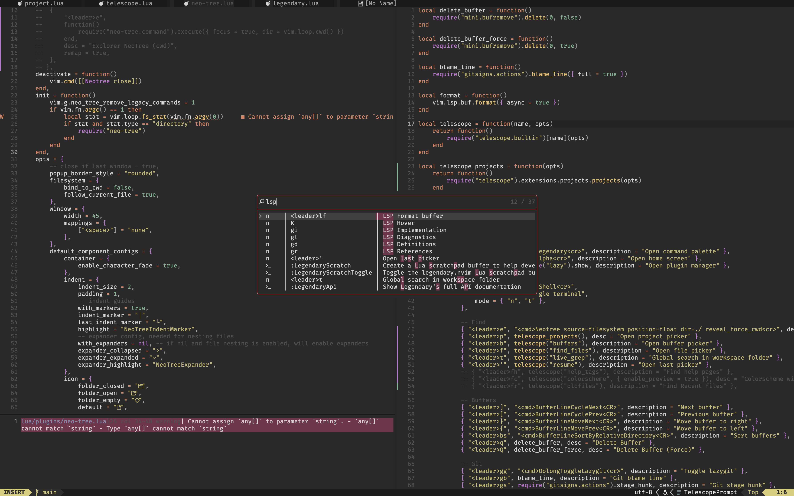

<h1 align="center">oolong.nvim</h1>
<h5 align="center">A warm color scheme for Neovim [wip]</h5>


## Instalation 

### Lazy
```lua
{
  "Grzdaczek/oolong.nvim",
  lazy = false, -- make sure we load this during startup if it is your main colorscheme
  priority = 1000, -- make sure to load this before all the other start plugins
  config = function()
    require("oolong").setup()
  end,
}
```

### Packer
```lua
use({
  "Grzdaczek/oolong.nvim"
  config = function()
    require("oolong").setup()
  end,
})
